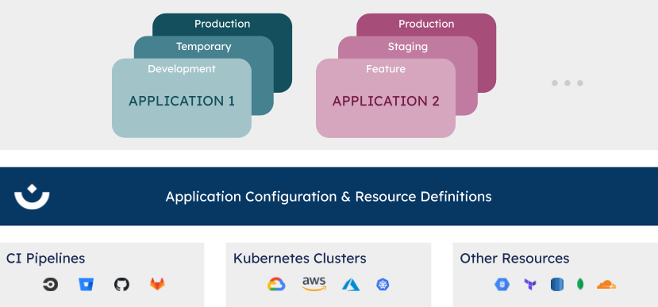

# We are Humanitec

**We provide an out-of-the-box internal developer platform to accelerate adoption of DevOps practices and Continuous Delivery for cloud-native, Kubernetes-based applications.**

## Introduction

Elite development teams breathe DevOps and Continuous Delivery. Following their lead, organizations that want to improve their performance embark on DevOps transformations and start adopting Continuous Delivery.

Despite moving to a loosely coupled architecture with matching dev team structure, investing in CI pipelines for all components, and automating a good chunk of testing, many find performance does not improve.

- Deployment frequency remains low meaning each deployment is bigger, riskier, and more stressful than it needs to be.
- Lead times remain high meaning customers are left waiting for that crucial bug fix.
- Talented developers are increasingly frustrated and so are more likely to leave.

Often adopting DevOps practices increases complexity for developers. This can happen by introducing new tooling (e.g. Terraform for IaC) and processes (e.g. new infrastructure must be approved by DevOps). Developers experience increased cognitive load which slows them down and increases frustration.

The leading tech companies like Spotify and Airbnb have solved these problems by building their own internal developer platforms. These elevate the developer experience by making DevOps related tasks single actions for developers.

Humanitec is your out-of-the-box internal developer platform for modern Kubernetes applications. It is modular and extensible - so use as much or as little as you need without compromising on your technology or tooling choices.

*With Humanitec, you can shield your developers from the complexity of Continuous Delivery, driving higher deployment frequency, lower lead times, and greater developer satisfaction.*

## Who is it for?

Humanitec is used by teams of all sizes, ranging from teams of 5-10 engineers at startups to teams of 150+ developers at enterprise companies.

With Humanitec, developers are autonomous. They can deploy their code to Kubernetes, spin up new environments, or even provision tech like databases. All of this without fiddling with manifests, cloud consoles, or Terraform. This all leads to a great developer experience.

DevOps specialists in the team have the freedom and flexibility to choose the tools they think are best for their organization. With Humanitec, DevOps can define how infrastructure and managed services are provisioned across applications and types of environments.

Humanitec is extensible and modular so it can be adapted to a wide range of situations. Out-of-the-box integrations make working with existing cloud setups quick and easy.

## How does it work?

Humanitec is available as API, CLI, and developer-focused UI. Humanitec can easily be integrated with your existing CI pipelines and your Kubernetes clusters, databases, and other managed services.

Developers work with applications that can be deployed to environments which they can spin up on demand - automatically provisioning dependent resources. DevOps can configure where these environments are run and how dependent resources are provisioned.

Humanitec is simple, extensible, and auditable.

- **simple**: Developers can get up and running in minutes. Standard DevOps tasks such as deploying code to Kubernetes, setting up environments, or even provisioning tech like databases can be completed with one command or click.
- **extensible**: Humanitec’s Open API allows you to integrate with tools of your choice and even extend Humanitec to interact with custom in-house technologies.
- **auditable**: Everything that runs through Humanitec is tracked. This means you know what was deployed, when and by who. This includes the full configuration down to the last environment variable making rolling back configuration a doddle.

## Our Vision

You can find our vision on our [company info page](https://humanitec.com/company).

## Our Roadmap

We are sharing our quarterly roadmap at the beginning of each quarter and evaluate what we achieved at the end of each quarter. We also have a high-level backlog of feature for future quarters. All the details are listed in [docs/roadmap.md](docs/roadmap.md).

## Our Docs-Site

Documentation is important to understand the basic concepts, the features, as well as to learn how to onboard to Humanitec in 10 minutes. All of this can be found [here](https://docs.humanitec.com). We also provide detailed documentation of our API which you can find [here](https://api-docs.humanitec.com).

## Other Resources

### Our Blog

We love to write about technology topics. Our blog can be found [here](https://humanitec.com/blog).

### Open Positions

We are always looking for talented developers that want to change the future of Continuous Delivery. Our job-page can be found [here](https://jobs.lever.co/humanitec).

### Change Log

We are documenting the changes we make with every release to production in a very simple format. You can find the overview [here](docs/change-log.md).

### Terms of Use

Find the official terms of use for Humanitec [here](https://humanitec.com/terms-and-conditions).

### Privacy Policy

Protecting your privacy is important to us. Find our privacy policy [here](https://humanitec.com/privacy-policy).
