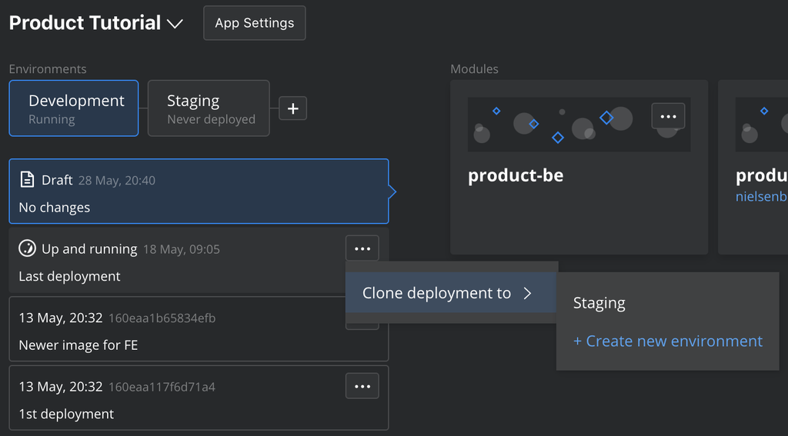
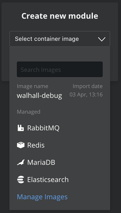

# Humanitec Change Log

This document provides an overview over the changes we are making with every release to production. Feel free to reach out to us in case of any specific questions.

## Release May 28th, 2020

General new features:

- Option to clone deployments to another environment 

- Added Elasticsearch and MariaDB as managed images 

- Allow to switch between drafts and deployments directly from the module configuration view 

New features only available via the API:

- Deploy to your own GCP account (API documentation will be pusblished soon on our [docs site](https://docs.humanitec.com))