# Humanitec Change Log

This document provides an overview of the changes we are making over time. Feel free to reach out to us in case of any specific questions.

## Product Update January 6th, 2022

- **Improved:** Responsive design of [Application Details Screen](https://docs.humanitec.com/reference/user-interface/app-details-screen) has been improved.

- **Fixed:** Workload variables with multiple [Placeholders](https://docs.humanitec.com/reference/concepts/app-config/placeholders) render correctly in the UI.

- **Fixed:** [`Create new app`](https://docs.humanitec.com/getting-started/create-sample-app#create-an-app-in-humanitec) input field validation no longer expands beyond the base element.

- **Fixed:** Alignment of the dropdown menu of Deployments on [Workload Details Screen](https://docs.humanitec.com/reference/user-interface/workload-details-screen).

- **Improved:** Reworded "mode" error message on Files component on [Workload Details Screen](https://docs.humanitec.com/reference/user-interface/workload-details-screen).

## Product Update December 23rd, 2022

- **Fixed:** Auto-focus on input fields no longer steals focus from the user.

- **Fixed:** Modals are no longer hidden on Firefox in the case of overflow.

- **Fixed:** The search filter in the images tab on the [Organization Settings Page](https://docs.humanitec.com/reference/user-interface/organization-settings) allows to filter images by name.

- **Improved:** It is no longer possible to [select an archived image version for a conatiner](https://docs.humanitec.com/using-humanitec/work-with-workloads/manage-container-images#change-the-image-on-a-container).

## Product Update December 2nd, 2022

- **New:** Released **Pausing & Resuming of Environments** feature which allows you to scale down all of the Workloads of type Deployment to 0 replicas with one click of a button or single API call. Resuming the environment will scale the Workloads back to the number of replicas that were set at the time of pausing. This can help you save costs on unused infrastructure. You can find more information in our [documentation](https://docs.humanitec.com/using-humanitec/work-with-environments/pause-and-resume).

- **Improved:** There is no longer a limit of the number of Applications users can create via the UI.

- **Fixed:** The [Profile Settings](https://docs.humanitec.com/reference/user-interface/top-bar#user-menu) page now correctly lists users' [roles](https://docs.humanitec.com/guides/manage-users-permissions/role-based-access-control) on all Organisations they are a member of. 

- **Fixed:** Resolved an issue where Placeholder autocompletion would not work properly with inputs typed manually and not selected from the dropdown. 

## Product Update November 11th, 2022

- **New:** Added autocompletion of [placeholders](https://docs.humanitec.com/reference/concepts/app-config/placeholders) in `labels`, `variables` and `files` properties of a Workload in [Deployment Sets](sets-and-deltas.md#deployment-sets).

- **Improved:** Performance of the `All deployment versions` functionality in the [App Details Screen](https://docs.humanitec.com/reference/user-interface/app-details-screen#overview) for Applications with a large number of past deployments.
 
- **Fixed:** Image version selector no longer requests all versions even if `show archived` option wasn't checked. It caused performance issues for images with a large number of archived versions.

- **Fixed:** Long Deploy comments no longer affect accessibility and alignment of action buttons in active deployment cards on the [App Details Screen](https://docs.humanitec.com/reference/user-interface/app-details-screen#overview).

- **Fixed:** An issue related to failing [Deployment Diff](https://docs.humanitec.com/using-humanitec/work-with-environments/deploy-to-environments/diff-deployments) of a past deployment after adding a [Shared Resource](https://docs.humanitec.com/using-humanitec/work-with-apps/shared-resources).

## Product Update October 28th, 2022

- **New:** Introduced a new API and updated UI which allow for image management at scale. Users can now identify, filter, archive and update images and their versions with ease. More detailed information on new capabilities can be found in the [feature announcement article](https://humanitec.com/blog/container-image-management-made-hassle-free-feature-announcement) on Humanitec's blog.   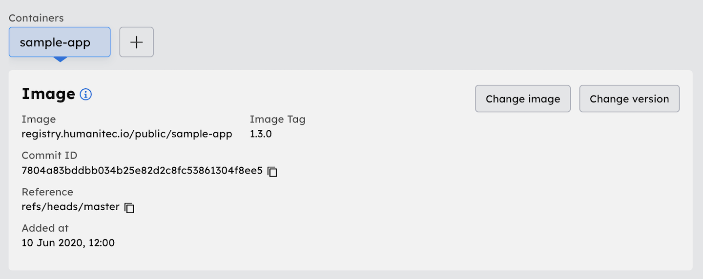

- **Fixed:** Provisioning a resource with an invalid [placeholder](https://docs.humanitec.com/reference/concepts/app-config/placeholders) now returns the expected error code with a more descriptive message.  

## Product Update October 7th, 2022

- **Fixed:** The replicas input field on the [Workload Details Page of an active deployment](https://docs.humanitec.com/reference/user-interface/workload-details-screen#active-deployment) is no longer displayed as enabled for users without the [deployer role](https://docs.humanitec.com/guides/manage-users-permissions/role-based-access-control#environment-type-roles) on the environment type.

- **Fixed:** An issue related to the [organization name](https://docs.humanitec.com/reference/user-interface/top-bar#organization-menu) being displayed as empty after users sign up to Humanitec.

- **Fixed:** The confirm modal which is displayed when deleting [matching criteria](https://docs.humanitec.com/reference/concepts/resources/definitions#matching-criteria) of a [resource definition](https://docs.humanitec.com/reference/concepts/resources/definitions) that has active resources associated with it is no longer showing duplicate content.

- **Improved:** The files editor which is utilised for the configuration of [webhooks](https://docs.humanitec.com/using-humanitec/work-with-apps/add-webhooks#create-a-webhook) and [files](https://docs.humanitec.com/using-humanitec/work-with-workloads/work-with-files#working-with-the-file-editor) now contains a "show whitespace characters" option to make users aware of potential formatting issues.

- **Improved:** YAML input for [container command and argument overrides](https://docs.humanitec.com/using-humanitec/work-with-workloads/manage-container-configuration#change-container-configuration) can now be copy-pasted.

## Product Update September 2nd, 2022

- **Improved:** The UI for [container overrides](https://docs.humanitec.com/using-humanitec/work-with-workloads/manage-container-configuration#change-container-configuration) on the [Workload Details Page](https://docs.humanitec.com/reference/user-interface/workload-details-screen#container-panel) has been reworked. Command and argument overrides can now be defined as YAML.  
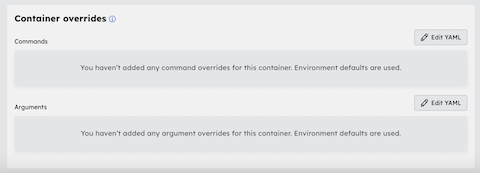

- **New:** Added support for archiving image versions on the [Organization Settings Page](https://docs.humanitec.com/reference/user-interface/organization-settings). This can be done by selecting the three dot menu of an image and clicking on `archive` next to a given version. Archived images remain accessible for use. An image can be `unarchived` anytime.  
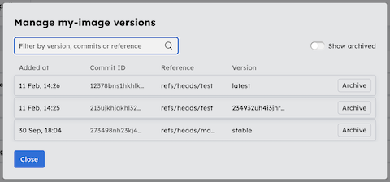

- **Fixed:** Corrected the runtime status for container pods stuck in phase `pending`. The [Workload Details Page of an active deployment](https://docs.humanitec.com/reference/user-interface/workload-details-screen#active-deployment) will now show a warning with `No container status available, pod is pending`.

- **Fixed:** An issue related log messages being cut off on the [Workload Details Page of an active deployment](https://docs.humanitec.com/reference/user-interface/workload-details-screen#active-deployment).

## Product Update August 12th, 2022

- **Improved:** Container images are no longer managed via a Humanitec specific ID. Instead, the image name (e.g. `registry.humanitec.io/public/sample-app:1.3.0`) is utilised as an identifier. The UI and documentation for the following features have been updated as a result of this:
  - [Add new image source](https://docs.humanitec.com/guides/connect-ci-setup/connect-ci-pipelines#add-new-image-sources)
  - [Create new container](https://docs.humanitec.com/using-humanitec/work-with-workloads/create-and-delete-containers#create-new-container)
  - [Change container image version](https://docs.humanitec.com/using-humanitec/work-with-workloads/change-container-image-version#change-the-version-of-a-container-image-in-a-workload)
  - [Create an automation rule](https://docs.humanitec.com/using-humanitec/work-with-environments/deploy-to-environments/automate-deployments#create-an-automation-rule)

- **Fixed:** An interaction bug related to deletion of [resource definitions](https://docs.humanitec.com/guides/orchestrate-infrastructure/dynamic-vs-static-resource-definitions) that have active resources associated with them. The confirmation modal now closes once the deletion has been confirmed.

- **Fixed:** Long [Workload variables](https://docs.humanitec.com/using-humanitec/work-with-workloads/work-with-environment-variables#add-an-environment-variable) are no longer cut off in view-only mode. The full value can be viewed via a tooltip on hover.

- **Fixed:** Long [Deploy comments](https://docs.humanitec.com/getting-started/create-sample-app#deploy-the-application) no longer overflow the active and past deployment cards on the [App Details Screen](https://docs.humanitec.com/reference/user-interface/app-details-screen#overview).

- **Fixed:** Runtime errors triggered by an invalid [service account](https://docs.humanitec.com/reference/workload-profiles/features/service-account#description) are now exposed on the [Workload Details Screen](https://docs.humanitec.com/reference/user-interface/workload-details-screen#overview) of running deployments.

## Product Update July 22nd, 2022

- **Changed:** Added a border as a visual indication for selected app deployments on the [App Details Screen](https://docs.humanitec.com/reference/user-interface/app-details-screen).

- **Improved:** The deployment status is now displayed for past deployments on the [App Details Screen](https://docs.humanitec.com/reference/user-interface/app-details-screen).  
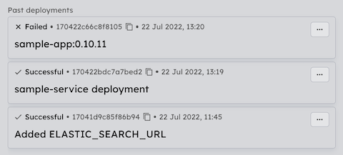

- **Improved:** Entities are no longer deleted without a warning. The deletion has to be confirmed by the user.  
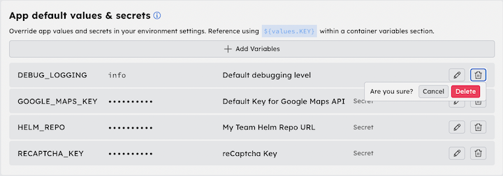

- **Improved:** Users attemping to downgrade their [organization level](https://docs.humanitec.com/guides/manage-users-permissions/role-based-access-control#organization-roles) or [app level](https://docs.humanitec.com/guides/manage-users-permissions/role-based-access-control#application-roles) role, have to confirm the role change in the UI.  
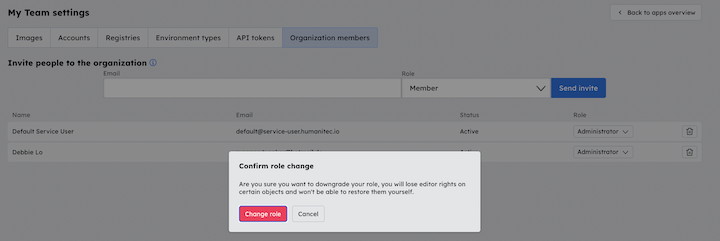

- **Fixed:** An interaction bug related to the "Active" toggle of the [Automations component](https://docs.humanitec.com/using-humanitec/work-with-environments/deploy-to-environments/automate-deployments#create-an-automation-rule) on the [Environment Settings Screen](https://docs.humanitec.com/reference/user-interface/environment-settings-screen).

## Product Update July 8th, 2022

- **New:** A loading bar is displayed on page load.

- **Changed:** Users have to type in the name of an application to confirm its [deletion](https://docs.humanitec.com/using-humanitec/work-with-apps/create-apps#deleting-an-app).  
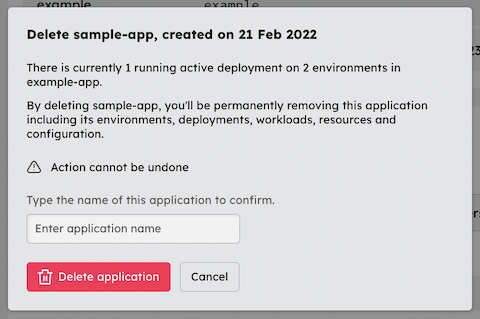

- **Improved:** Pending [invitations to a Humanitec organization](https://docs.humanitec.com/guides/manage-users-permissions/role-based-access-control#inviting-users-to-an-organization) display the time until expiration.  
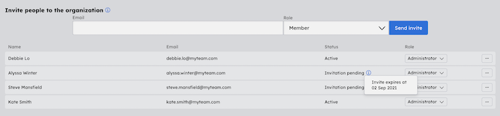

## Product Update June 17th, 2022

- **New:** Removing a [resource definition](https://docs.humanitec.com/reference/concepts/resources/definitions) that has active resources depending on it will mark it as `Pending deletion` in the UI until all the resources associated with it are re-deployed.  
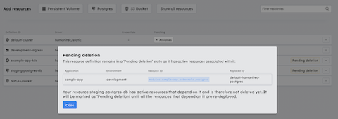

- **Changed:** Implemented a dedicated view-, add-, and edit-mode for several components to give users more control when making changes in the UI. See the [App Members](https://docs.humanitec.com/guides/manage-users-permissions/role-based-access-control#application-roles) section as an example:  
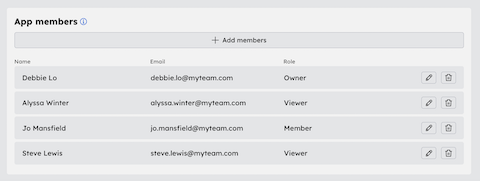

- **Changed:** The colour contrast of the [dark- and light theme](https://docs.humanitec.com/reference/user-interface/top-bar#user-menu) according to the Web Content Accessibility Guidelines (WCAG) 2.1.

- **Fixed:** Error messages no longer persist between the configuration overlays in the Accounts section of the [Organization Settings Page](https://docs.humanitec.com/reference/user-interface/organization-settings).

## Product Update June 3rd, 2022

- **Improved:** The user experience for working with [cronjob schedules](https://docs.humanitec.com/using-humanitec/work-with-workloads/manage-cronjob-schedules) in the UI. Cron expressions...
  - can be pasted into any of the schedule input fields.
  - can be copied.
  - are translated into human readable text.  
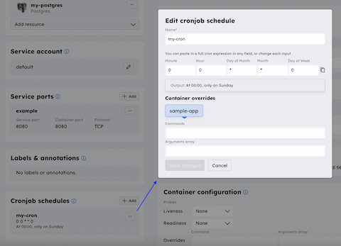

- **Fixed:** On the [Resource Management Page](https://docs.humanitec.com/reference/user-interface/resource-management), deleting a matching criteria that has active resources associated with it no longer silently fails in the UI. The action has to be confirmed by the user.  
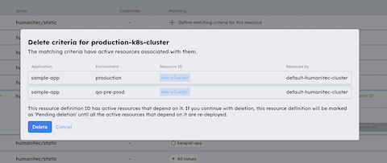

- **Fixed:** An interaction bug related to the population of secret values in the [shared values and secrets overrides](https://docs.humanitec.com/using-humanitec/work-with-environments/override-values-and-secrets#environment-level) component.

- **Fixed:** The handling of [placeholder values](https://docs.humanitec.com/reference/concepts/app-config/placeholders) when configuring a resource definition on the [Resource Management Page](https://docs.humanitec.com/reference/user-interface/resource-management). As usual, a literal `${` can be inserted by escaping the `{` with a backslash.  
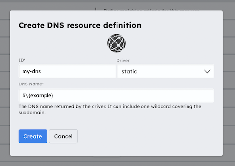

## Product Update May 20th, 2022

- **Changed:** Namespaces are now managed via [Humanitec Resources](https://docs.humanitec.com/reference/user-interface/resource-management) and are therefore no longer visible on the [Environment Settings Screen](https://docs.humanitec.com/reference/user-interface/environment-settings-screen). A resource definition of type `k8s-namespace` can be created using the `humanitec/static` or `humanitec/template` driver. Learn more [here](https://docs.humanitec.com/guides/orchestrate-infrastructure/define-namespaces).

- **Fixed:** An interaction bug related to automatic [environment level overrides](https://docs.humanitec.com/guides/orchestrate-infrastructure/manage-environment-variables-and-secrets#environment-level) for certain [app default values and secrets](https://docs.humanitec.com/guides/orchestrate-infrastructure/manage-environment-variables-and-secrets#app-level).

- **Fixed:** Clicking into the `value` field of a secret variable in the [shared values and secrets overrides](https://docs.humanitec.com/using-humanitec/work-with-environments/override-values-and-secrets#environment-level) section no longer causes the value to temporarily disappear in the UI.

## Product Update May 6th, 2022

- **Fixed:** [Persistent volumes](https://docs.humanitec.com/guides/orchestrate-infrastructure/manage-persistent-volumes) added as shared resources to an Application are no longer missing from the [deployment manifest](https://docs.humanitec.com/guides/manage-application-configuration/export-manifests-humanitec-and-gitops).

- **Fixed:** Values defined as part of [app default values & secrets](https://docs.humanitec.com/guides/manage-application-configuration/manage-environment-variables-and-secrets#app-level) can be empty.

- **Fixed:** [Variable placeholders](https://docs.humanitec.com/using-humanitec/work-with-workloads/work-with-environment-variables#using-placeholders) no longer break if a [resource dependancy](https://docs.humanitec.com/using-humanitec/work-with-workloads/manage-resource-dependencies) has the same ID as the Workload.

- **Fixed:** Payload entries of [webhooks](https://docs.humanitec.com/using-humanitec/work-with-apps/add-webhooks) are now preserved in the UI.

- **Fixed:** Users that hold the [Developer or Owner role](https://docs.humanitec.com/guides/manage-users-permissions/role-based-access-control#application-roles) on an Application can delete environments of types they have [Deployer rights](https://docs.humanitec.com/guides/manage-users-permissions/role-based-access-control#environment-type-roles) for.

- **Fixed:** Selecting "Manage versions" on an image (inside the Images tab on the [Organization Settigs Page](https://docs.humanitec.com/reference/user-interface/organization-settings)) that is missing a tag will no longer throw an error in the UI.

- **Fixed:** Container states are no longer shared between Workloads when navigating via the breadcrumb menu.

- **Improved:** Enhanced error messaging for Azure authentication issues with [AKS clusters](https://docs.humanitec.com/guides/orchestrate-infrastructure/manage-kubernetes-clusters#azure-aks-cluster).

- **Improved:** Changes made in the UI after a session expires are no longer lost with no warning. Instead the user will be directed to the [login page](https://app.humanitec.io/auth/login).

## Product Update April 22nd, 2022

- **New:** Added support for [Resource References](https://docs.humanitec.com/reference/concepts/resources/references), which allow to reference the outputs of other resources from within [Resource Definitions](https://docs.humanitec.com/reference/concepts/resources/definitions).

- **New:** Images can now be added by image name. This allows to create container objects in Workloads that pull from registries not registered with Humanitec as described [here](https://docs.humanitec.com/using-humanitec/work-with-workloads/create-and-delete-containers#add-image-by-image-name).

- **Fixed:** An interaction bug related to copying the ingress path on running deployments.  
  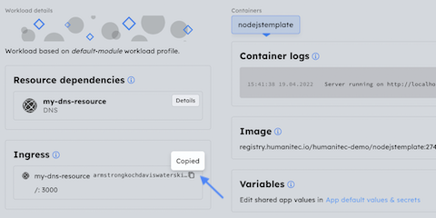

- **Improved:** Error messages for driver connection failures on cloudsql postgres database instances are now being fully surfaced in the UI.

## Product Update April 8th, 2022

- **Fixed**: The UI no longer prevents users from updating the credentials of an existing resource definition on the [Resource Management Page](https://docs.humanitec.com/reference/user-interface/resource-management).

- **Fixed**: For existing resource definitions utilizing the `humanitec/template` driver, updating one field will no longer clear the adjacent input field.

- **Fixed**: The validation of `sub-directories` specified as part of [volume mounts](https://docs.humanitec.com/guides/orchestrate-infrastructure/manage-persistent-volumes#define-a-volume-mount-for-a-container) on the [Workload Details Page](https://docs.humanitec.com/reference/user-interface/workload-details-screen).

- **Fixed:** Changes made to the [service account](https://docs.humanitec.com/reference/workload-profiles/features/service-account) of a Workload are no longer discarded if no container has been added yet.

- **Fixed:** Added support for pinning Workloads via the `pin to top` button on Firefox.

- **Fixed:** A number of small interaction bugs with duplicate or persisting error messages.

## Product Update March 11th, 2022

- **Fixed:** Workloads based on the [default-cronjob profile](https://docs.humanitec.com/reference/workload-profiles/profiles/default-cronjob) are no longer marked as `failed` in a running deployment when there is no failure.

- **Fixed:** When editing an existing resource definition on the Resource Management Page:
  - Driver input values are reflected correctely in the UI.
  - The UI no longer forces an update of secret values.

- **Fixed:** When inviting a new user to an Organization that is already a member of a different Organization the UI no longer incorrectly displays an error message.

- **Fixed:** Drafts based on deployment clones no longer persist in the UI after being deployed.

- **Fixed:** The `Service account` field on the Workload Details Page can now be cleared.

- **Fixed:** Workloads can be pinned via the `pin to top` button on the App Details Page.

- **Fixed:** App- and workload level environment variables can have empty values.

- **Improved:** The design of several resource icons on the Resource Management Page.  
  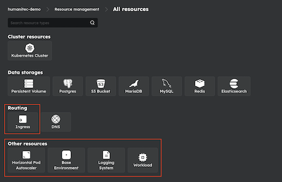

## Product Update February 25th, 2022

- **Fixed:** A deployment issue with `Postgres` resources.

- **Fixed:** An interaction bug related to editing existing `Volume Mounts` on the Workload Details Page.

- **Fixed:** Creating a draft from a deployment diff no longer times out in the UI.

- **Improved:** Service and container ports configured on the Workload Details Page must be in the range 1 - 65535.

## Product Update February 11th, 2022

- **Fixed:** The authentication flow for active Humanitec users accepting invites to a new Organization.

- **Fixed:** A temporary authentication issue related to new users accepting invites to an Organization.

- **Fixed:** An interaction bug related to discarding deployment clones in the UI.

- **Fixed:** Error messages on the "Create new environment" overlay and the "Account details" form are no longer hidden in the UI.

- **Improved:** Nested values are now supported by the resource `Details` overlay on the App Details- and Workload Details Page of running deployments.

- **Improved:** Error message handling for users attempting to log in without a registered GitHub or Google account.

- **Improved:** Existing `Volume Mounts` are now validated in the UI when being updated.

## Product Update January 21st, 2022

- **New:** Added support for [Service Ports](https://docs.humanitec.com/reference/workload-profiles/features/service) on the Workload Details Page.  
  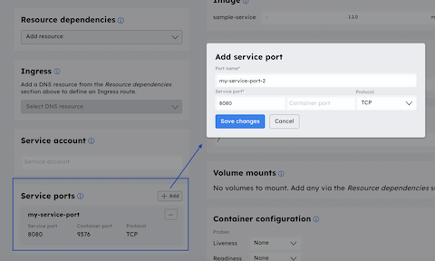

- **Fixed:** Corrected form validation on the "Accept Invite" page.

- **Fixed:** Switching Organization on the App Details or Workload Details Page no longer causes a "We can't find the app you are looking for" error (403).

- **Fixed:** Defining `Volume Mounts` for shared `Persistent Volume` resources no longer causes a deployment to fail.

- **Fixed:** Several UI issues, including:

  - The user-dropdown on the "Manage deployers for x environment type" overlay as well as the image-dropdown on the "Create new container" overlay are no longer cut off.
  - Removed redundant "More" link on dropdown menus.
  - A number of interaction bugs with discarding deployment clones in the UI.

- **Changed:** Initial input validation is triggered `on submit` instead of `on blur` in the majority of cases.

## Product Update January 7th, 2022

- **Improved:** Custom Workload Profiles based on [supported features](https://docs.humanitec.com/reference/workload-profiles/features) are dynamically displayed and editable in the UI.

- **New:** Added support for [Labels](https://docs.humanitec.com/reference/workload-profiles/features/labels) & [Annotations](https://docs.humanitec.com/reference/workload-profiles/features/annotations) on the Workload Details Page.  
  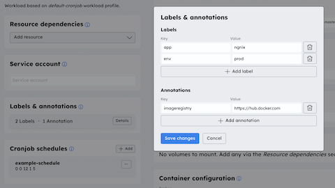

- **New:** Added support for [CronJobs](https://docs.humanitec.com/reference/workload-profiles/features/schedules) on the Workload Details Page.  
  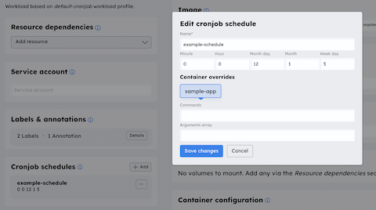

- **Fixed:** On the App Details Page, Workload error states are now being indicated on the Workload card.  
  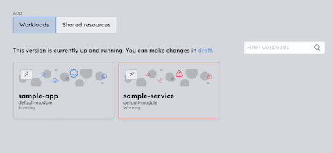

- **Fixed:** The edit overlay of Kubernetes cluster resources with the `humanitec/k8s-cluster-eks` driver no longer displays incorrect form parameters.

- **Fixed:** An Environment Type can now be deleted in the UI if an environment with the same ID exists in the active Organization.

- **Fixed:** The "Deploy changes" confirmation overlay no longer reloads after being submitted via keyboard enter.

- **Fixed:** Validation of the "Resource ID" matching criterion on the Resource Management Page.

- **Fixed:** Several UI issues, including:
  - Corrected routing of "Back to" button on the Organization Settings Page.
  - Updated "Learn more" link for Workload level error messages.
  - Removed duplicate Ingress resource type from Resource Management Page.
  - Improved handling of special characters in the Deployment Diff.

## Product Update December 17th, 2021

- **Fixed:** When deleting a shared `Persistent Volume` resource, associated `Volume Mounts` are automatically removed from the Workload as well.

- **Fixed:** Environment variables no longer throw an error for empty values.

- **Fixed:** A Safari browser compatability issue.

## Product Update December 3rd, 2021

- **Fixed:** Creating a new webhook no longer throws an error.

- **Fixed:** It is no longer possible to switch the driver when editing an existing resource definition.

- **Fixed:** A number of smaller interaction bugs with setting resource requirements for CPU and Memory.

- **Fixed:** The help modal is fully accessible on the log in page again.

## Product Update November 17th, 2021

- **New:** Added Cloudflare to the Accounts section in the UI.  
  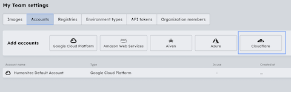

- **Changed:** Workloads are added via an overlay which allows users to change the underlying Workload Profile if needed.  
  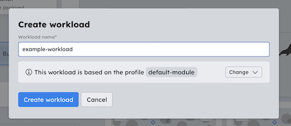

- **Improved:** A containers maximum and minimum resource requirements for CPU and Memory can now be cleared in the UI. This enables full support for all QoS (Quality of Service) classes in Kubernetes: BestEffort, Burstable and Guaranteed.

- **Fixed:** An interaction bug related to selecting "all images except" on the environment automation component.

- **Fixed:** An interaction bug related to duplicating Workloads.

- **Fixed:** Several UX issues in relation to selecting and deleting draft deployments.

- **Fixed:** The scaling of replicas on the Workload Details Page of a running deployment is no longer limited to two. In addition to that can a Workload temporarily be disabled by scaling its replicas down to 0.

- **Fixed:** Validation for volume mount path now correctly requires a rooted path with at least 1 directory.

- **Improved:** Accessibility according to the Web Content Accessibility Guidelines (WCAG) 2.1:
  - Improved app content for screen readers.
  - Improved keyboard accessibility of submenus and toggles.

## Product Update October 29th, 2021

- **New:** Added support for updating Resource Account credentials.

- **New:** Added a "Status" column to the Organization Members list. After an invitation is sent, the user's status is pending. When the recipient accepts the invitation, their user status switches to active.

- **New:** The user role is now visible on the Profile Settings Page.

- **Fixed:** Reselecting the currently active Organization in the Organization Menu no longer makes a hard refresh of the App Overview Page necessary.

- **Improved:** Users are notified if their currently active environment on the App Details Page has been deleted and are automatically directed to the next environment.

- **Improved:** Keyboard accessibility according to the Web Content Accessibility Guidelines (WCAG) 2.1:
  - (Un-)pinning of Workloads.
  - Editing of Files on the Workload Details Page.

## Product Update October 19th, 2021

- **Changed:** Resources are no longer managed as "Dynamic Resources" and "Static Resources" in the Organization Settings. The implementation of a new Resources Management screen instead allows to manage the provisioning and allocation of resources in one place.  
  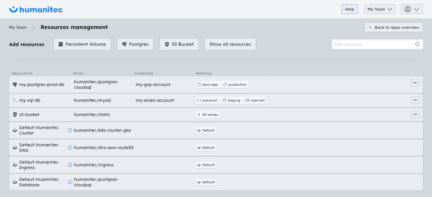

- **New:** Next to Environment Types, Resource Definitions can now be matched to Environment Names, Apps as well as Resource IDs in the UI.  
  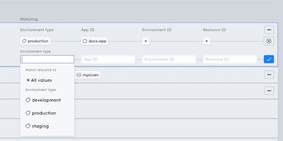

- **Changed:** Organization Settings and Resources Management were moved from the User Menu to the Organization Menu.  
  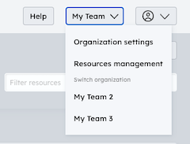

- **Changed:** Accounts are now managed from a separate tab in the Organization Settings. Users can dynamically reference existing accounts when configuring resources from the Resources Management screen.  
  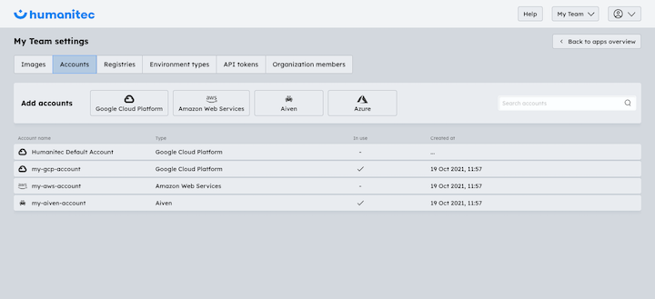

- **New:** It is now possible to define headers for "HTTP link" Liveness and Readiness probes on the Workload Details Page.  
  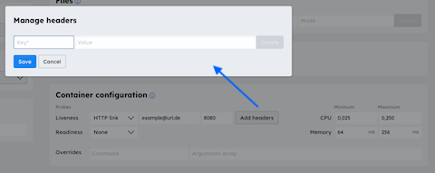

- **Improved:** If a shared DNS resource is deleted, associated Ingress paths are automatically removed from the according Workloads as well.

- **Improved:** Accessibility according to the Web Content Accessibility Guidelines (WCAG) 2.1:

  - Enhanced keyboard accessibility throughout the application.
  - Improved website content for screen readers.

- **Fixed:** The UI no longer forces updates of secrets when editing an existing Resource Definition.

- **Fixed:** Several interaction bugs when (de-)activating environment automation rules.

- **Fixed:** The "Manage versions" overlay for Images in the Organization Settings no longer throws an error for images without an image tag.

- **Fixed:** Several UI issues, including:
  - The user dropdown on the "Manage deployers" overlay no longer opens by default and blocks the view.
  - The "Active" toggle on the Webhooks component is no longer clickable by users in Developer role.
  - Error states are no longer shared between account configuration overlays.
  - Switching between drafts no longer causes issues on the UI.

## Product Update September 10th, 2021

- **Improved:** Numerous accessibility improvements for keyboard only users.

- **Improved:** Better icons for resources.

- **Fixed:** Corrected validation for namespace and container names.

- **Fixed:** Resources not duplicated when workload duplicated.

- **Fixed:** Placeholders for shared resources not expanded in Config Map.

- **Fixed:** Better handling of long app and environment names.

- **Fixed:** Organization names overflow organization-switcher dropdown.

- **Fixed:** Menus at the bottom of lists are truncated as they go off the screen.

- **Fixed:** Some resource and workload creation actions were not possible for users with some roles.

- **Fixed:** Number of small interaction bugs with managing roles for users.

- **Fixed:** Clone functionality in some cases is missing view of detailed changes.

- **Fixed:** Discard clone causes a page refresh.

## Product Update August 27th, 2021

- **New:** Added support for custom Workload Profiles in the UI. Next to the default profile `default-module` users now have the option to choose a different profile according to their use case. Container images are added in a second step on the Workload Details Page.  
  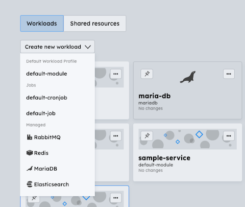

- **New:** Resources can now be provisioned on App level. On the Application Details Page, users have the option to add shared resources that can be referenced within the Workloads of their App.  
  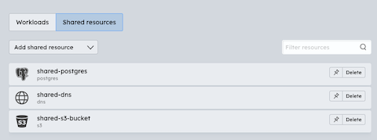

- **New:** Added support for partial clones. Instead of cloning the entire deployment by default, users can now choose to include / not include certain Workloads in their clone.  
  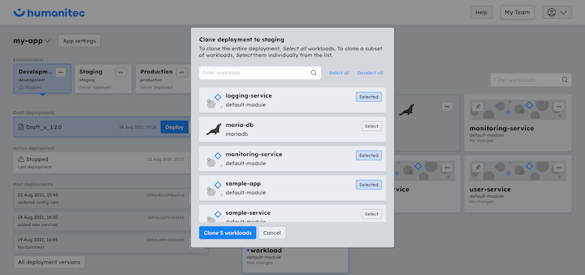

- **New:** Added a `...` settings icon to App cards with shortcuts to "View", "Settings" and "Delete".

- **New:** Users using ad-blockers are now warned that some features will not be available to them in the Humanitec UI. The reason for this is that Humanitec uses a system called Optimizely for UI feature flags. If a user has ad blocking services enabled that block calls to Optimizely, it has to be manually removed from the blacklist in the ad-blocking extension in order to access all Humanitec features.

- **Improved:** Container images are now sorted by date.

- **Improved:** Several UI components have been transformed into link elements that allows users to open them in a separate browser tab.

- **Changed:** The design of several UI components:

  - Increased color contrasts in the light theme.
  - Increased the font size of label elements.
  - Adjusted the design of tooltips.
  - Intensified the border color of Workloads in the "Has changes" state.

- **Changed:** The following wordings:

  - `External resources` has been renamed to `Resource dependencies` on the Workload Details Page.
  - The `Close` button has been replaced with a `Back to ...` button.

- **Fixed:** Draft deployments are now accessible during running deployments.

- **Fixed:** It is no longer possible to create Workloads in deleted Environments.

- **Fixed:** Ports defined for liveness and readiness probes in the container configuration section are now displayed on the Workload Details Page of running deployments.

- **Fixed:** The Deploy button was renamed to Re-Deploy for active deployments.

## Product Update August 13th, 2021

- **Fixed:** Draft deployments can now be accessed while a deployment is in progress.

- **Fixed:** The environment status no longer defaults to "Stopped" after a successful deployment.

- **Fixed:** Several UI issues, including:

  - Entering multiple Placeholder Paths into the Value field of the Variables component no longer breaks the UI.
  - Placeholder Paths in the Value field of the Variables component now support dash characters.
  - The "More Environments" dropdown on the App Details Page no longer overflows for large amount of environments.

- **Improved:** Keyboard accessibility according to the Web Content Accessibility Guidelines (WCAG) 2.1.

## Product Update July 16th, 2021

Nothing to report for todays product update as our team has been taking some well earned time off in the past 2 weeks. The next update will be published on August 13th.

## Product Update July 2nd, 2021

- **New:** Workload cards can now be pinned to the top of the App Details Page. This allows users to set focus on most relevant workloads in the UI.  
  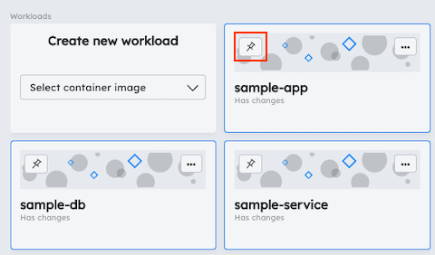

- **New:** Dynamic resources can now be connected to Humanitec via Azure accounts.

- **Changed:** The deploy button has been moved into the draft- and deployment list items on the left hand side of the App Details Page.  
  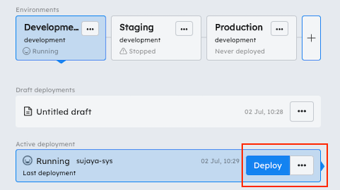

- **Improved:** Humanitec's accessibility according to the Web Content Accessibility Guidelines (WCAG) 2.1:

  - Improved keyboard accessibility with focus on links, table-, and list components.
  - Improved navigation flows throughout the application.

- **Fixed:** It is now possible to remove previously specified overrides for the container command in the container configuration of the Workload Details Page.

- **Fixed:** Environment status (Running/Stopped/Failed) and status icon are now in sync on the Environment Settings Page.

- **Fixed:** User names are being shown again on active and past deployments on the App Details Page.

## Product Update June 18th, 2021

- **New:** Added an image build versions overview for each container image registered with Humanitec. This allows to review image versions and filter by commit ID, branch, or tag.  
  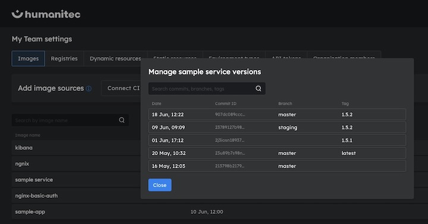

- **New:** Added information on resource details to the Workload Details Page of running deployments.  
  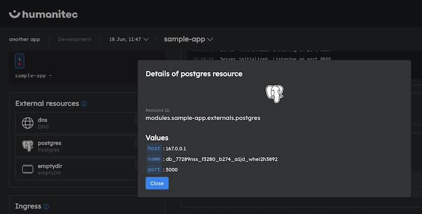

- **Fixed:** The environment runtime status is no longer mirrored on all environment tabs of an Application.

- **Fixed:** Deleting a volume resource no longer leaves invalid volume mounts in the Workload but instead removes these automatically.

- **Fixed:** Deleting a DNS resource now automatically removes all associated routing rules defined in the Ingress section of the Workload.

- Several UI fixes, including:
  - **Fixed:** The draft version dropdown on the App Details Page no longer overflows for large amount of draft versions.
  - **Improved:** Added an automatic copy interaction to Ingress routes shown on the Workload Details Page of running deployments.
  - **Improved:** Enhanced error message handling in several parts of the application.

## Product Update June 4th, 2021

- **Changed:** Significantly simplified how to connect CI pipelines (like Bitbucket Pipelines, GitHub Actions, and Circle CI) from the Images tab in Organization settings. The CI pipelines just need to notify Humanitec about new image builds. Check out the docs for [more information](https://docs.humanitec.com/how-to-guides-devops/infrastructure-orchestration/connect-ci-pipelines#add-new-image-sources).  
  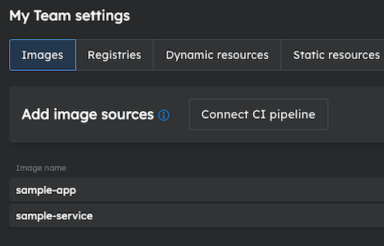

- **Fixed:** Changes made in a Draft are no longer replicated to running and past deployments in the UI.

- **Fixed:** When deleting an App, the Drafts associated with it will no longer show up in subsequently created Apps of the same name.

- **Fixed:** Ingress manifests are no longer missing from exported manifests of running and past deployments with allocated Ingress resources.

- Several UI fixes, including:
  - **Fixed:** When changing a Variable key in a Draft, the old value will now be displayed on the deployment Diff.
  - **Improved:** When adding a file to a Draft, its path is displayed in addition to its mode on the deployment Diff.
  - **Fixed:** Overflowing deployment Diffs and Workload errors are now scrollable.
  - **Improved:** Active deployments that stopped running are marked as "Stopped".

## Product Update May 21st, 2021

- **New:** Added support for path-based routing with Ingress on the Workload Details Page. This feature replaces the Public URL section.

  - DNS resource can now be added in the External Resources section.
  - Routing rules are defined within the newly added Ingress component.  
    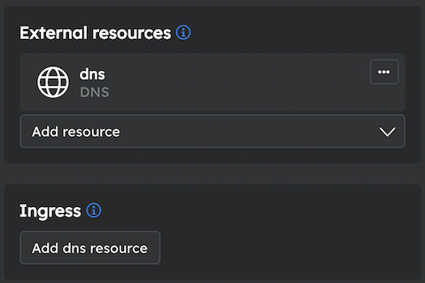

- **Changed:** Design and layout of App Settings. Added a danger zone and removed tabs from the UI to allow for a clearer overview and structure of the screen.

- **Improved:** Extended error message handling via tooltips in the Variables component for invalid placeholder paths.

- **Fixed:** It is now possible to add variables to a workload with multiple containers.

- **Fixed:** Configuration of Webhooks.
  - Closing the triggers-dropdown no longer removes all selected triggers.
  - Existing Webhooks can be disabled/enabled.

## Product Update May 7th, 2021

- **New:** Added support for [third-party container registries](https://humanitec.com/blog/third-party-container-registries-feature-announcement).  
  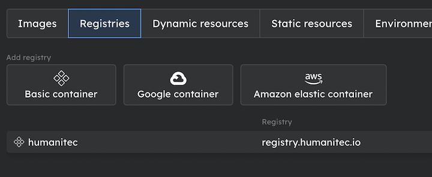

- **Fixed:** It is now possible to cancel the creation of a workload on the application details page.

- **Fixed:** The image dropdown on the Workload Details Page no longer overflows.

- **Improved:** Defined handling of special characters such as "\", '<' or '>' in the variables component on the Workload Details Page.

- **Changed:** The full image name is now shown for automatic deployment comments.

## Product Update April 23rd, 2021

- **New:** Added support for emptyDir volumes.  
  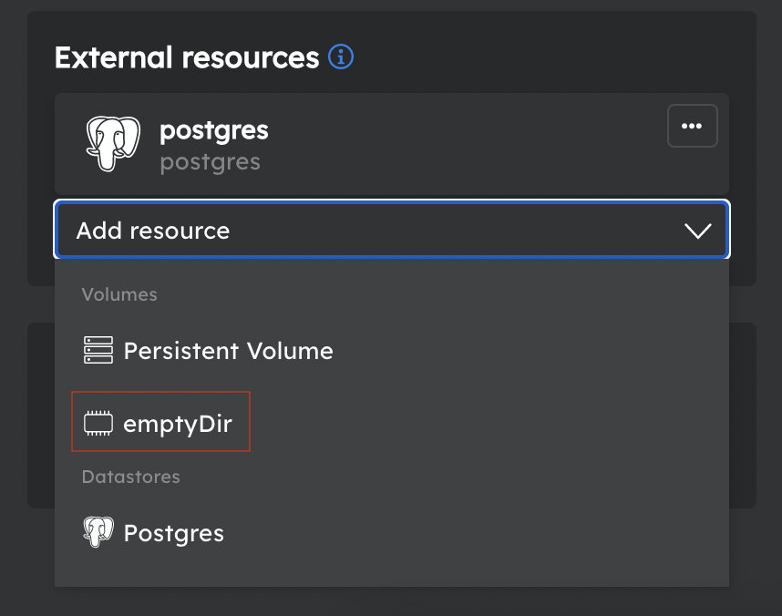

- **Improvement:** We reworked the behaviour of the Variables component on the Workload Details Page. Inconsistencies in terms of its navigation and handling were removed to ensure a reliable user experience for entering, editing and saving data.

  - Improved keyboard accessibility.
  - Easier handling of Placeholder Paths.
  - Corrected behaviour for multi-line input.

- **Fixed:** It is no longer possible to cause a failed deployment due to a file being mounted into the root of a container.

- **Fixed:** Many UI inconsistencies.

## Product Update April 9th, 2021

- **New:** Added support for [Persistent Volumes](https://humanitec.com/blog/feature-announcement-persistent-volumes).  
  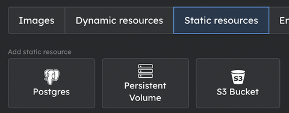  
  Mount paths are specied on the workload level.  
  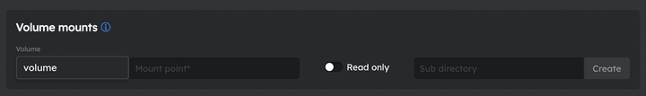

## Product Update April 2nd, 2021

We will shift the product update to April 9th due to the short break over Easter.

## Product Update March 19th, 2021

- **New:** Forms for adding resource definitions now present fields in a more intuitive order and include help text.  
  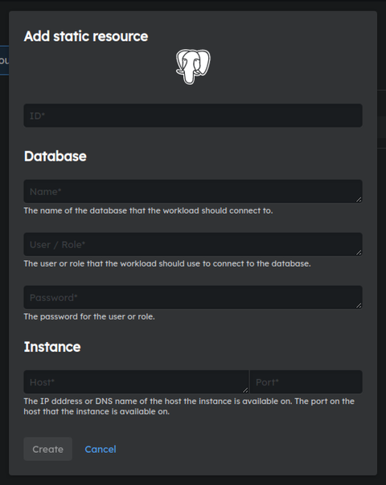

- **Improvement:** Draft can now be discarded even if it is the only draft. (A new blank draft is created in its place.)

- **Fixed:** Behaviour of clones in the UI is corrected. Clone includes comment from deployment it was created from and is properly represented in the draft. Code version can be updated in the draft applied to clone.
- **Fixed:** Submitting variable value now possible when suggestions drop-down is shown.
- **Fixed:** Live container statuses sometimes not shown after deployment.

## Product Update March 5th, 2021

- **New:** Pod status is now communicated on the Workload tile in the Active Deployment mode.

- **Fixed:** It is now possible to replace a deleted resource definition with a new one of the same type with overlapping matching criteria while the original one is still in _pending deletion_ state.

## Product Update February 19th, 2021

- **New:** Errors at the Environment level are now surfaced in UI.
- **New:** Aiven added as an Account Type & [documentation](https://docs.humanitec.com/how-to-guides-devops/infrastructure-orchestration/manage-relational-databases/aiven) added for connecting Aiven managed databases.  
  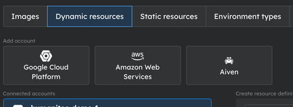

- **Improved:** Environments and Deployments pane in Workload Details screen expanded and Environment Tabs restructured.

- **Fixed:** Clicking outside the Dynamic/Static Resource Definition dialog does not cause all data to be automatically lost.
- **Fixed:** Form for specifying static DNS did not handle TLS certificates correctly.
- **Fixed:** Many UI inconsistencies.

## Product Update February 5th, 2021

- **New:** Workloads can now depend on multiple resources of the same type.  
  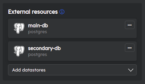
- **New:** Added support for Aiven (Database-as-a-Service provider).  
  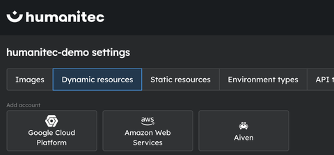

- **Changed:** We changed the default deployment behaviour so that workloads no longer wait for a successful readiness probe before terminating the old pods. This means that the state of the namespace will match the requested deployment, but will mean that pods might be in a failed state. These will be reported in the UI. It will also mean deployments complete much faster. We are working on [Blue/Green Deployments](roadmap.md#bluegreen-deployment-strategy) to provide a reliable way of ensuring environment wide consistency.

- **Improved:** Both, our [GitHub Action](https://github.com/Humanitec/build-push-to-humanitec) as well as our [CircleCI Orb](https://circleci.com/developer/orbs/orb/humanitec/humanitec), now support the specification of additional docker arguments (e.g., `build-args`).
- **Improved:** Updated documentation of environment variables & secrets and container configuration.

- **Fixed:** Failing application deletion in the case of deployment errors.
- **Fixed:** Last environment in an application can no longer be deleted.

## Product Update January 22nd, 2021

Here is our first product update 2021. We started with some important new features into the new year.

- **New:** We created an Environment Settings Screen that bundles all environment-specific settings. We moved the _Automation Rules_ and environment-specific _Shared values and secrets overrides_ into this new screen. We now also allow users to specify a namespace in Kubernetes for each environment. This has been supprted by the API but not by the UI.  
  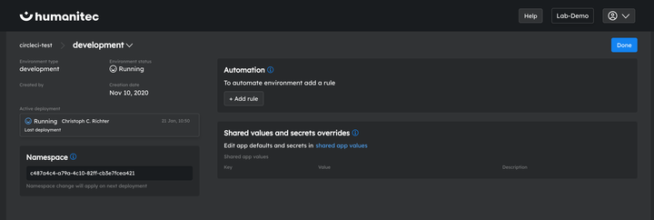
- **New:** We are now allowing users to delete environments directly from the environment dropdown menu on the App Details Screen.  
  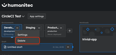
- **New:** Out-of-the-box support for Amazon S3 buckets as Dynamic Resources.  
  

- **Improved:** Support multi-line values in _Shared values and secrets_.
- **Improved:** Listing of dynamic resources.

- **Fixed:** Adding overrides for shared variables cause console error _Cannot read property 'id' of undefined_.
- **Fixed:** Missing UI elements after creating a new environment.

## Product Update Janaury 8th, 2021

We enjoyed some time off between the years and we hope you did too. Stay tuned for the first product update 2021 which we will publish on January 22nd.

## Product Update December 25th, 2020

- **New:** Add configuration as a file that will be accessible from your container (UI&API).  
  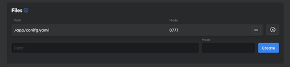
- **New:** Specify Service account that a pod should adopt via UI.  
  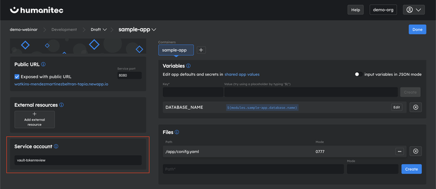
- **New:** Create Webhooks Deployment (started/finished) and Environment (created/deleted) events. (UI&API).  
  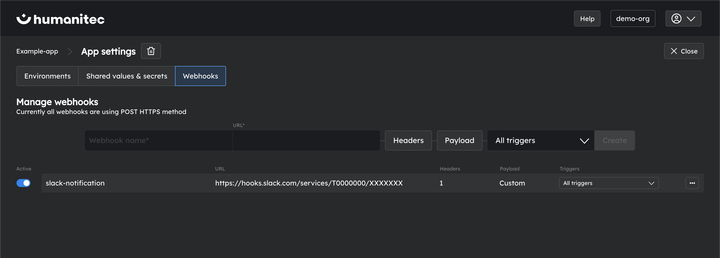

- **Improved:** Show deployers for all deployments.
- **Improved:** Show who created a resource definition.
- **Improved:** User experience for re-deploying a historical deployment set.

- **Fixed:** It’s not possible to remove command overwrites and args.
- **Fixed:** The overview of deploy changes does not show removed env variables.
- **Fixed:** Container images dropdown for adding a workload is partially hidden.
- **Fixed:** Adding substitute variables for s3bucket.
- **Fixed:** Small UI issues on Firefox.
- **Fixed:** Blinking smiley behavior :-)

## Product Update December 11th, 2020

- **Improved:** Environments are ordered by creation date instead of alphabet.
- **Improved:** Users can choose to delete an environment type and see associated environments.
- **Improved:** A lot of great styling updates!

- **Fixed:** After adding a managed workload (Redis) the workload dropdown selection is not cleared.

## Product Update November 27th, 2020

- **Fixed:** Selecting placeholder from prompt popup causes currently entered text to be ovewritten.
- **Fixed:** After creating a draft from a diff the module detail page is not updated.
- **Fixed:** Envtype list is cut off on static resources page.
- **Fixed:** After deploying the user can directly see the currently running version instead of the draft.
- **Fixed:** Variables are not displayed in the diff if it is removed.
- **Fixed:** S3 bucket should only be available for adding to module when a S3 resource definition exists.
- **Fixed:** user reported issues with user pagination and user invite via Github.

- **Improved:** Based on user feedback, changed _Modules_ to _Workloads_ across application.

## Product Update November 13th, 2020

- **New:** A "My Apps" screen with all applications that a user has an access to as well as their respective environments. The user can choose to open the required application or an environment directly from the My Apps screen.  
  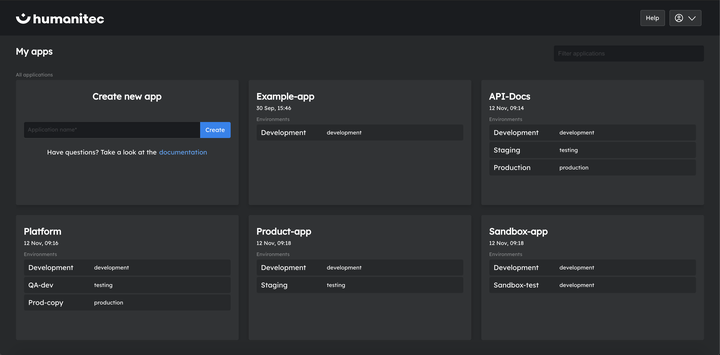
- **New:** Redirect to "My Apps" after deleting an application.
- **New:** Introduced an error screen for javascript errors and 404s with a redirect to "My Apps".

- **Fixed:** Automated deployments do not show up in UI until they are finished.

- **Improved:** Scroll bars across application.

## Product Update October 30th, 2020

- **New:** Deleting Resource Definitions via the UI. If the resource definition has any active resources associated with it, the user is informed about those resources and their suggested replacements. If the user proceeds with the deletion, the resource definition will be marked with pending deletion until all active resources are redeployed.  
  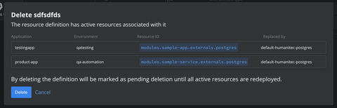

- **Improved**: Input component for shared value overrides.
- **Improved**: Snippet for Bitbucket integration.

- **Fixed**: Error handling in a case of a blank screen.
- **Fixed**: Allowing users to select “None” for static resources that do not need a driver.
- **Fixed**: Real-time updates for automated deployments.

## Product Update October 16th, 2020

- **New**: UI and API for adding your AKS and EKS clusters.  
  
- **New**: UI and API for adding S3 Bucket resource definition and defining dependency within your modules.
- **New**: Welcome emails to newly registered users.

- **Improved**: Container runtime status added to application view - users can see at a glance if any of their modules are failing.  
  
- **Improved**: Expandable deployment history view. Users can filter based on deployment comment and find their historical deployments easier.  
  
- **Improved**: CI integration guide - now presented as a wizzard.  
  

## Product Update October 2nd, 2020

- **New**: Export manifests for your chosen deployment set. Manifests can be downloaded as .yaml files and stored in a repository.  
  
- **New**: UI support for connecting your own GKE or EKS cluster via Static Resources.  
  

- **Improved**: Possibility to add and confirm contact email through profile settings if it is not retrieved during registration.

## Product Update September 18th, 2020

- **New**: UI for adding AWS accounts for dynamic ressources  
  
- **Improved**: UI for managing API Tokens
  - See all API Tokens for an organization in one list
  - Create new API Tokens
  - View and revoke existing API Tokens  
    

## Product Update September 4th, 2020

- **New**: UI for Runtime status
  - View the runtime status for deployed applications and easily debug errors when they occur
  - Users are informed if any of the replicas are failing and the affected deployment and modules are marked with a warning
  - To simplify debugging, container errors are reported for each replica separately and presented to the user together with the container log  
    
- **New**: API for deleting resources
- **Improved**: Live container logs
  - Users do not have to refresh to see the latest logs
  - Fixed UI issues and logs formatting
- **Fixed**: Wrong DNS being shown for modules (user reported bug)

## Product Update August 21st, 2020

- **Improved**: Container logs
  - Users can now see logs for each historical deployment
  - Fixed inconstiencies reported by users  
    
- **New**: [Humanitec CircleCI Orb](https://circleci.com/orbs/registry/orb/humanitec/humanitec) for simple integration between CircleCI and Humanitec  
  

## Product Update August 7th, 2020

UI improvements:

- Separation between _Profile Settings_ and _Organization Settings_  
  

Documentation update:

- Release of the API documentation (currently in beta) available [here](https://api-docs.humanitec.com) incl. a first tutorial how to use the Humanitec API  
  

## Product Update July 24th, 2020

General new features:

- First version of automatic deployments based on user-defined rules  
    
  

## Product Update July 10th, 2020

General new features:

- Allow users to connect dynamic resources of type Postgres with Google Cloud Platform resource account  
  

UI improvements:

- Better overview over available image versoins  
  
- Improved database selector  
  

New API endpoints:

- API endpoint for deployment automation - allowing users to create, update and delete rules for automated deployments; Humanitec deploy new images automatically based on the defined rules

## Product Update June 26th, 2020

General new features:

- Option to create multiple deployment drafts in an environment  
  

Onboarding support:

- First version of in-app guide explaining how to deploy your first application with Humanitec  
  

## Product Update June 12th, 2020

General new features:

- Option to create a diff between two deployment sets within one environment  
  
- Allow for patching of environments: apply a diff to a deployment set in any environment  
  

Onboarding support:

- Added sample images that allow for a quicker onboarding (e.g., option to deploy first application without connecting own CI pipelines)  
  

## Product Update May 29th, 2020

General new features:

- Option to clone deployments to another environment  
  
- Added Elasticsearch and MariaDB as managed images  
  
- Allow to switch between drafts and deployments directly from the module configuration view  
  

New features only available via the API:

- Deploy to your own GCP account (API documentation will be pusblished soon on our [docs site](https://docs.humanitec.com))
